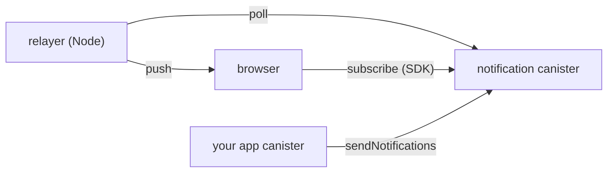

# Local development

Run the full IC web push stack — notification canister, relayer, app canister, browser — locally. Mixing local and mainnet doesn't work: inter-canister calls won't cross, and pushes won't reach a local browser without a relayer you control.



This guide assumes you can already drive [`icp`](https://cli.internetcomputer.org/) (or `dfx`), `cargo`, and a JS bundler — it only covers what's specific to this stack.

## 1. Notification canister

Two options. Pick whichever matches your CLI of choice.

**Option A — pull via `dfx` (recommended).** The canister exposes `dfx:pullable` metadata, so dfx fetches the released wasm directly. In your project's `dfx.json`:

```json
{
  "version": 1,
  "canisters": {
    "notification_canister": {
      "type": "pull",
      "id": "zjwxf-jyaaa-aaaao-a43ca-cai"
    }
  }
}
```

Then `dfx deps pull && dfx deps init && dfx deps deploy`. The local canister id matches the mainnet one. `icp` doesn't yet support deps pull, so this step is dfx-only — but it composes fine with the rest of the guide running on `icp`.

**Option B — build from source via `icp`.** Use this if you're staying on `icp` end-to-end, or if you're modifying the canister:

```bash
git clone https://github.com/research-ag/notification-service.git
cd notification-service
cargo build --release --target wasm32-unknown-unknown
```

Register the resulting `target/wasm32-unknown-unknown/release/notification_canister.wasm` as a pre-built canister in your `icp.yaml` and `icp deploy`.

Note the canister id either way — relayer, app canister, and frontend all need it.

## 2. Relayer

The relayer (`src/relayer/`) polls the canister every ~10s and delivers Web Push to subscribers. Configure via `.env` (see `.env.example`):

- `IC_HOST` — your local replica
- `NOTIFICATION_CANISTER_ID` — from step 1
- `RELAYER_ED25519_SECRET_KEY` — base64 of 32 or 64 bytes Ed25519 secret material (seed or secret+public). Generate a 32-byte seed with: `node -e "console.log(require('crypto').randomBytes(32).toString('base64'))"`
- `VAPID_SUBJECT`, `VAPID_PUBLIC_KEY`, `VAPID_PRIVATE_KEY` — generate the keypair once with `npx web-push generate-vapid-keys`

Then `npm ci && npm run build && npm run start`. Until step 3 completes you'll see `'Relayer not registered'` traps every poll cycle — expected.

## 3. Register the relayer

A canister controller authorizes the relayer by principal. Derive the relayer's principal from its secret:

```bash
node -e "
  const { Ed25519KeyIdentity } = require('@dfinity/identity');
  const raw = Buffer.from(process.env.RELAYER_ED25519_SECRET_KEY, 'base64');
  console.log(Ed25519KeyIdentity.fromSecretKey(raw).getPrincipal().toText());
"
```

Then call `registerRelayer(<principal>, <vapid_public_key>, <label>)` on the canister. Verify with `listRelayers`.

## 4. App canister

Wrap [`example/notification_delegate.mo`](./example/notification_delegate.mo) — it gives you a typed `sendNotifications` call. Override `NOTIFICATION_CANISTER_ID` to your local one. Minimal app:

```motoko
import NotificationDelegate "./notification_delegate";

persistent actor {
  transient let notifications = NotificationDelegate.getActor();

  public func send(to : Principal, title : Text, body : Text) : async [Bool] {
    let payload : NotificationDelegate.NotificationBody = {
      title; content = body; url = null; tag = null;
    };
    await notifications.sendNotifications([(to, payload)]);
  };
};
```

For a fuller worked example see [`example/chat_app.mo`](./example/chat_app.mo) and [`example/chat_frontend/`](./example/chat_frontend).

## 5. Frontend

`@research-ag/ic-web-push` requires three things specific to this stack:

- An **authenticated** `HttpAgent` — anonymous principals are rejected by `ensureSubscribed`. For local dev, generate and persist an `Ed25519KeyIdentity` client-side; in production swap for II / NFID / your real auth.
- The service worker file at `/ic-web-push-sw.js` in your served web root: `cp node_modules/@research-ag/ic-web-push/sw.js public/ic-web-push-sw.js` (path varies by bundler).
- A **secure origin** — `http://localhost` and `http://127.0.0.1` qualify; anything else needs HTTPS.

```ts
import icWebPush from '@research-ag/ic-web-push';

icWebPush.init({
  agent,                    // authenticated HttpAgent (call await agent.fetchRootKey() on local)
  applicationCanisterId,    // your app canister id
  notificationCanisterId,   // notification canister id from step 1
});

await icWebPush.ensureSubscribed({ requestPermissionIfNeeded: true });
```

## 6. Send a test notification

Subscribe in the browser first — the canister registers your app implicitly on the first browser `subscribe`; direct `sendNotifications` before then trap with `Application not found`.

Then call your app's send method. A notification should appear within ~10s (the relayer's poll cadence).

## Troubleshooting

- **`Anonymous principal is not supported`** — pass an authenticated identity to your `HttpAgent`.
- **`Registration failed - permission denied`** while scripting Playwright — default contexts are incognito and Chrome disables Push API in incognito. Use `launchPersistentContext`.
- **Service worker 404** — `sw.js` isn't at `/ic-web-push-sw.js` in your web root. See step 5.
- **Inter-canister call fails with `Application not found`** — no browser has subscribed against this app canister yet. Complete steps 5–6 first.
- **Inter-canister call from app canister fails (other reasons)** — confirm the delegate is using your local `notificationCanisterId`, not the hardcoded mainnet default.
- **Relayer traps `'Relayer not registered'` or logs `unauthorized`** — re-run step 3 with the principal the relayer actually uses on startup.
- **Subscription succeeds but no notification arrives** — check the relayer is running, registered (`listRelayers`), and pointed at the right canister and host.
